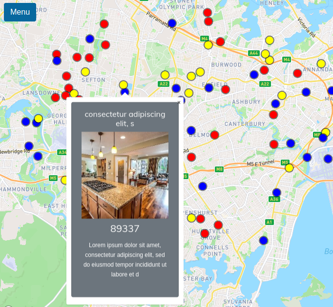

# Web mapping Z-1

This is a static website with an interactive map embedded. This site has about, contact, private, terms, and main pages. The main page is a Mapbox map that contains fake points, each with a popup that shows a short information.

## Live Demo
[webmappingz1.pages.dev](https://webmappingz1.pages.dev)

## Built with
* [Bootstrap](https://getbootstrap.com/)
* [Mapbox](https://www.mapbox.com/)
* [Vue.js](https://vuejs.org/)

## How to use
After cloning this project on your local machine, go to mapbox.com, create an account, a get a token. Open the main file "App.vue" find this variable "mapboxgl.accessToken" and paste your token there.

## License

[The Unlicense](https://unlicense.org/) 

